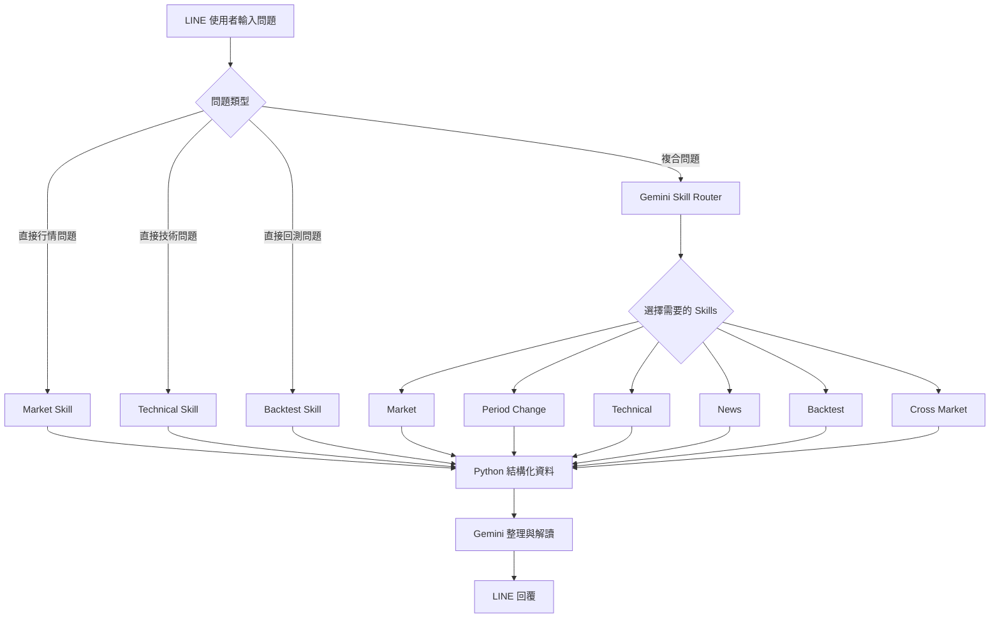
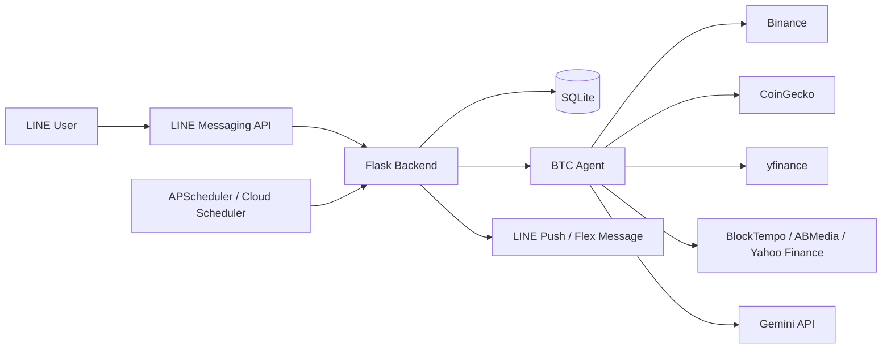
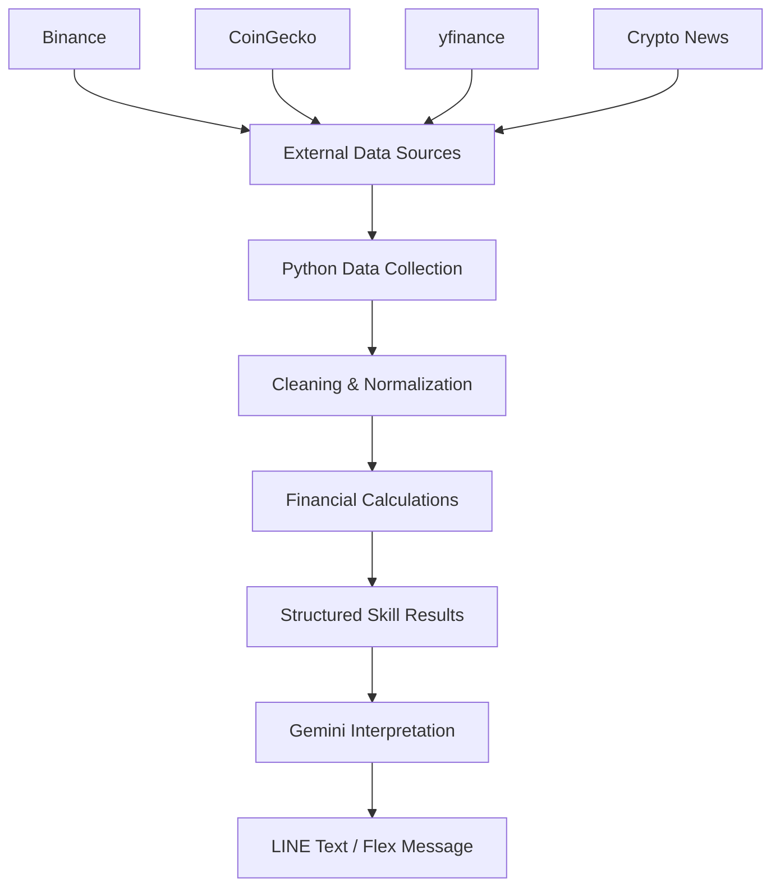

# ₿ BTC AI 智能投資資訊助手

<p align="center">
  <b>Bitcoin AI Investment Information Assistant</b><br>
  LINE Bot × Market Data × Technical Analysis × Backtesting × News AI × Personalized Alerts
</p>

<p align="center">
  
  
  
  
  
</p>

---

## 📖 專案介紹

**BTC AI 智能投資資訊助手**是一套以 LINE Bot 為使用介面的 Bitcoin 市場資訊系統。

系統整合 Bitcoin 即時行情、技術指標、加密新聞、歷史策略回測、跨市場分析與個人化提醒，並透過 Gemini AI Agent 判斷使用者問題需要哪些資料模組，再將 Python 實際取得與計算的結果整理成適合 LINE 閱讀的內容。

本專案的核心概念是：

> **Python 負責資料取得與數值計算，AI 負責理解問題與統整解讀。**

藉此降低讓生成式 AI 自行產生金融數字的風險，同時保留自然語言互動的便利性。

---

## ✨ 核心功能

### 💰 1. BTC 即時市場行情

透過 Binance 取得 BTC/USDT 市場資訊：

- 即時價格
- 約當新台幣參考價
- 近 1 小時漲跌幅
- 24H 漲跌幅
- 24H 最高價 / 最低價
- BTC 成交量
- USDT 成交額
- 成交筆數

也支援自然語言期間查詢，例如：

```text
BTC 最近 3 小時漲多少？
BTC 最近 7 天表現如何？
BTC 近 3 個月漲跌多少？
BTC 2024/1/1 到 2025/1/1 漲多少？
```

---

### 📊 2. 技術分析

系統使用 Binance 日 K 資料計算：

- MA5
- MA20
- MA60
- RSI14
- MACD
- Signal Line
- MACD Histogram

技術指標由 Python 計算後，再由 AI 根據實際數值關係進行文字整理，而不是由 AI 自行推算指標。

---

### 📰 3. BTC 新聞分析

新聞來源包含：

- **BlockTempo 動區動趨**
- **ABMedia 鏈新聞**
- **Yahoo Finance**（Daily Brief 使用）

資料處理流程包含：

```text
取得新聞
   ↓
日期與時間整理
   ↓
移除無效資料
   ↓
URL / 標題去重
   ↓
BTC 相關性篩選
   ↓
Gemini 重要性排序
   ↓
新聞文本情緒分析
   ↓
LINE 顯示
```

AI 會從候選新聞中挑選較值得優先閱讀的事件，並標記：

```text
正向 / 中性 / 負向
```

此分類描述的是**新聞文本的敘事傾向**，不是未來 BTC 漲跌預測。

---

### 📈 4. MA20 / MA60 策略回測

系統提供 Bitcoin 歷史策略回測：

```text
MA20 > MA60 → 持有 BTC
MA20 <= MA60 → 空手
```

回測包含：

- Buy & Hold
- MA20 / MA60 策略
- 扣除交易成本後策略
- 累積報酬率
- 年化波動度
- 最大回撤
- Sharpe Ratio
- 買 / 賣持倉切換訊號

預設參數：

```text
回測期間：近 5 年
交易成本：0.1% / 每次持倉切換
Sharpe Ratio：Rf = 0
年化方式：sqrt(365)
```

若使用者指定較早期的 Bitcoin 歷史期間，系統會依資料可用範圍選擇：

```text
Binance BTC/USDT
或
CoinGecko BTC/USD
```

同一段歷史期間不混接兩種價格來源。

---

### 🌎 5. 跨市場分析

透過 `yfinance` 比較：

| 市場 | Yahoo Finance Symbol |
|---|---|
| Bitcoin | BTC-USD |
| Ethereum | ETH-USD |
| S&P 500 | ^GSPC |
| NASDAQ | ^IXIC |
| Gold | GC=F |

分析內容：

- 近期市場報酬率
- BTC 與其他市場報酬率相關係數
- Rolling Correlation
- Gemini 跨市場文字解讀

> 相關係數只表示觀察期間內的統計連動，不代表因果關係。

---

### 🔔 6. 個人化提醒

使用者可以直接從 LINE 設定提醒。

#### 價格提醒

```text
提醒價格高於 120000
提醒價格低於 90000
```

#### 24H 漲跌幅提醒

```text
提醒24H漲幅 5%
提醒24H跌幅 5%
```

#### RSI 提醒

```text
提醒RSI高於 70
提醒RSI低於 30
```

#### 1H 劇烈波動提醒

```text
設定波動提醒 3%
```

代表當 BTC 近 1 小時漲跌幅達：

```text
+3% 或 -3%
```

時主動發送 LINE 提醒。

提醒採用狀態防重複機制：

```text
未達條件
   ↓
第一次跨越門檻
   ↓
發送提醒
   ↓
條件仍成立 → 不重複洗版
   ↓
回到門檻外
   ↓
重新待命
   ↓
下次再次跨越 → 再次提醒
```

---

### 🌞 7. 個人化 Daily Brief

使用者可以自訂每日 BTC 摘要時間：

```text
設定每日提醒 09:30
```

Daily Brief 整合：

- BTC 市場行情
- 技術指標
- 重要新聞
- 新聞文本情緒
- BTC / ETH 跨市場資訊
- Gemini AI 今日解讀

每日摘要以 **LINE Flex Message** 卡片呈現，使用者可再點選：

```text
查看完整分析
```

取得完整內容。

---

## 🤖 AI Agent 架構

目前 Agent 可使用六個主要 Skills：

```python
get_btc_market()
get_btc_period_change()
get_btc_technical()
get_btc_news()
get_btc_backtest()
get_cross_market()
```

Gemini 會先判斷問題狀態：

```text
OK
CLARIFY
OUT_OF_SCOPE
```

再決定需要哪些 Skills。

### Agent Flow



部分常見查詢會直接由 Python 模組處理，不必先等待 Gemini Skill Router，例如：

- 即時行情
- 技術分析
- 回測

因此即使 Gemini 暫時繁忙，部分核心功能仍可運作。

---

## 🏗️ 系統架構



---

## 🔄 資料 Pipeline



---

## 🛠️ Tech Stack

### Backend

```text
Python
Flask
Gunicorn
APScheduler
SQLite
```

### Data & Analysis

```text
Pandas
Requests
yfinance
BeautifulSoup
Binance API
CoinGecko
```

### AI

```text
Google Gemini API
Gemini 3.1 Flash Lite
```

### Interface

```text
LINE Messaging API
LINE Bot SDK v3
LINE Flex Message
```

---

## 📁 專案結構

建議 GitHub Repository 整理成：

```text
btc-ai-line-bot/
│
├── app_project_final.py
├── btc_agent_final.py
├── requirements.txt
├── .gitignore
├── README.md
│
└── btc_ai.db               # 本機資料庫，不建議上傳公開 Repo
```

### ⚠️ 上傳 GitHub 前建議重新命名

如果目前檔案名稱是：

```text
app_project_final(3).py
btc_agent_final(2).py
requirements(1).txt
gitignore(1).txt
```

建議改為：

```text
app_project_final.py
btc_agent_final.py
requirements.txt
.gitignore
```

因為主程式使用：

```python
import btc_agent_final as btc_agent
```

所以檔案名稱需要與 import 一致。

---

# 🚀 Getting Started

## 1. Clone Repository

```bash
git clone <YOUR_GITHUB_REPOSITORY_URL>
cd btc-ai-line-bot
```

---

## 2. 建立 Python 虛擬環境

### Windows

```bash
python -m venv .venv
.venv\Scripts\activate
```

### macOS / Linux

```bash
python3 -m venv .venv
source .venv/bin/activate
```

---

## 3. 安裝套件

```bash
pip install -r requirements.txt
```

目前使用的主要套件：

```text
flask
gunicorn
line-bot-sdk
requests
pandas
yfinance
beautifulsoup4
APScheduler
python-dotenv
```

---

## 4. 建立 `.env`

在專案根目錄新增：

```text
.env
```

加入：

```env
LINE_CHANNEL_ACCESS_TOKEN=your_line_channel_access_token
LINE_CHANNEL_SECRET=your_line_channel_secret
GEMINI_API_KEY=your_gemini_api_key
SCHEDULER_SECRET=your_scheduler_secret
```

### Environment Variables

| Variable | 用途 |
|---|---|
| `LINE_CHANNEL_ACCESS_TOKEN` | LINE Messaging API |
| `LINE_CHANNEL_SECRET` | LINE Webhook 驗證 |
| `GEMINI_API_KEY` | Gemini API |
| `SCHEDULER_SECRET` | 保護雲端 `/scheduler-check` Endpoint |

> ⚠️ `.env` 含有私密金鑰，請勿上傳至 GitHub。

---

## 5. 啟動 Flask

```bash
python app_project_final.py
```

預設：

```text
http://127.0.0.1:5000
```

---

# 🌐 Flask Routes

| Route | Method | 功能 |
|---|---|---|
| `/callback` | POST | LINE Webhook |
| `/btc-market` | GET | 取得 BTC 市場行情 |
| `/n8n-test` | GET | n8n 連線測試 |
| `/scheduler-check` | GET | 雲端排程觸發提醒檢查 |

---

## `/scheduler-check`

雲端部署時，可由外部排程服務定期呼叫：

```text
https://YOUR_DOMAIN/scheduler-check?token=YOUR_SCHEDULER_SECRET
```

此 Endpoint 會執行：

```text
每日摘要時間檢查
個人化條件提醒
1H 劇烈波動提醒
```

並使用 `SCHEDULER_SECRET` 驗證請求。

> 不要把真正的 `SCHEDULER_SECRET` 寫在 README、程式碼或公開 Repository。

---

# ⏰ Scheduler

本機直接執行 Python 主程式時，APScheduler 設定為：

| 工作 | 頻率 |
|---|---:|
| 每日摘要時間檢查 | 每 1 分鐘 |
| 價格 / 漲跌 / RSI 提醒 | 每 5 分鐘 |
| 1H 波動提醒 | 每 5 分鐘 |

Timezone：

```text
Asia/Taipei
```

正式部署若使用 Gunicorn，建議由外部 Cron / Scheduler 定期呼叫：

```text
/scheduler-check
```

避免只依賴 `if __name__ == "__main__"` 中的本機 APScheduler。

---

# 💬 LINE 使用範例

## 市場行情

```text
現在 BTC 一顆多少？
```

```text
BTC 最近 24 小時漲多少？
```

```text
BTC 2025/1/1 到 2026/1/1 漲多少？
```

## 技術分析

```text
BTC 現在技術面如何？
```

```text
RSI 現在多少？
```

```text
MACD 現在怎麼看？
```

## 新聞

```text
最近有什麼 BTC 重要新聞？
```

```text
最新消息
```

## 回測

```text
幫我回測近 5 年 MA20/MA60
```

```text
回測 2020/1/1 到 2025/1/1
```

## 跨市場

```text
跨市場
```

```text
最近 BTC 跟 NASDAQ 有一起動嗎？
```

## 個人化提醒

```text
提醒價格高於 120000
提醒價格低於 90000
提醒24H漲幅 5%
提醒24H跌幅 5%
提醒RSI高於 70
提醒RSI低於 30
設定波動提醒 3%
```

## 每日摘要

```text
設定每日提醒 09:30
查看每日提醒
關閉每日提醒
```

## 提醒管理

```text
查看提醒
檢查提醒
刪除提醒 1
個人化設置
```

---

# ☁️ Deployment

專案可部署至支援 Python Web Service 的平台，例如：

```text
Render
AWS
Google Cloud
Azure
Railway
```

Production 建議使用：

```bash
gunicorn app_project_final:app
```

並在部署平台設定 Environment Variables：

```text
LINE_CHANNEL_ACCESS_TOKEN
LINE_CHANNEL_SECRET
GEMINI_API_KEY
SCHEDULER_SECRET
```

LINE Developers 的 Webhook URL 設為：

```text
https://YOUR_DOMAIN/callback
```

Webhook 必須正常回傳：

```text
HTTP 200
```

---

# 🗄️ SQLite

系統使用：

```text
btc_ai.db
```

儲存：

### `alerts`

- LINE User ID
- 提醒類型
- 提醒門檻
- 是否啟用
- 條件狀態
- 最近觸發時間

### `user_settings`

- 每日摘要時間
- 是否啟用每日摘要
- 最近推播日期
- 是否啟用 1H 波動提醒
- 波動門檻

---

# 🔐 Security

`.gitignore` 建議至少包含：

```gitignore
# Private
.env

# Python
__pycache__/
*.pyc

# Virtual environment
.venv/
venv/

# Editor
.vscode/
.ipynb_checkpoints/

# Database
*.db

# System
.DS_Store
Thumbs.db
```

### 上傳 GitHub 前請確認

- [ ] `.env` 沒有被加入 Git
- [ ] API Key 沒有直接寫在 Python
- [ ] `btc_ai.db` 沒有上傳公開 Repository
- [ ] LINE Channel Access Token 沒有曝光
- [ ] LINE Channel Secret 沒有曝光
- [ ] Gemini API Key 沒有曝光
- [ ] Scheduler Secret 沒有曝光

如果任何 Token 曾經被 Push 到公開 GitHub，建議立即重新產生。

---

# 🧩 系統設計重點

## 1. AI 不直接負責金融計算

市場價格、MA、RSI、MACD、相關係數與回測結果主要由 Python 計算。

Gemini 主要負責：

```text
理解問題
選擇 Skills
新聞重要性整理
文本情緒分析
自然語言解讀
```

---

## 2. 歷史資料來源一致性

若完整區間可由 Binance 涵蓋：

```text
Binance BTC/USDT
```

若查詢起點早於 Binance BTC/USDT 可用歷史：

```text
CoinGecko BTC/USD
```

整段使用單一來源，不在同一次期間計算中混接 Binance 與 CoinGecko。

---

## 3. 防止 Look-ahead Bias

MA20 / MA60 回測會先準備 MA60 所需的暖機歷史資料，正式回測時依已知訊號計算後續策略表現，避免直接使用未來資訊。

---

## 4. AI Failure Fallback

對常用的：

```text
即時行情
技術分析
回測
```

設計直接 Python 查詢路徑。

因此 Gemini Skill Router 暫時忙碌時，不一定會讓所有核心查詢一起失效。

---

## 5. LINE Flex Message

每日摘要與提醒可用 LINE Flex Message 呈現：

```text
市場價格
24H 漲跌
RSI14
新聞情緒
今日焦點
```

相較單純文字訊息，更適合手機介面閱讀。

---

# 🔮 Future Work

- [ ] AWS / Azure / GCP 正式部署
- [ ] Docker 容器化
- [ ] PostgreSQL / Cloud Database
- [ ] Redis Cache
- [ ] Binance WebSocket 即時行情
- [ ] ETH / SOL 等更多幣種
- [ ] 更多量化交易策略
- [ ] 策略參數最佳化
- [ ] 回測 Equity Curve 圖表
- [ ] 多策略績效比較
- [ ] Portfolio Analysis
- [ ] RAG 新聞知識庫
- [ ] Web Dashboard
- [ ] 使用者登入與設定管理
- [ ] n8n 自動化工作流
- [ ] Cloud-native Scheduler

---

# ⚠️ Disclaimer

本專案僅供：

- Python 程式設計學習
- API 串接實作
- AI Agent 專題
- 金融資料分析
- Bitcoin 市場研究
- 歷史策略回測

使用。

本系統提供的市場資料、技術分析、新聞整理、AI 解讀與歷史回測結果，**均不構成任何投資建議**。

歷史績效不代表未來績效，任何投資決策與風險皆應由使用者自行評估。

---

# 📜 License

目前專案以學習、作品集與專題展示用途為主。

若未來公開成為開源專案，可加入：

```text
MIT License
```

或其他合適的開源授權。

---

<p align="center">
  Made with Python 🐍 + LINE 💬 + Bitcoin ₿ + Gemini 🤖
</p>
