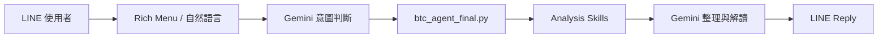
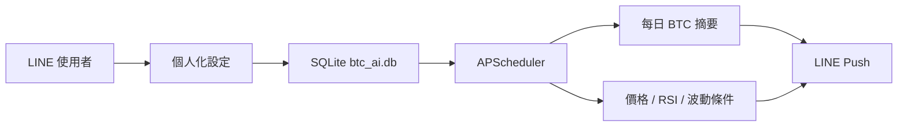

# BTC AI 智能投資資訊助手

結合 **AI Agent、多來源財經資料、量化分析、策略回測與 LINE 個人化推播** 的 Bitcoin 資訊整合專案。

本專案從「查 Bitcoin 價格」出發，進一步整合即時行情、技術分析、新聞、跨市場資料、長期策略回測與個人化提醒，讓使用者可以直接透過 LINE 以自然語言查詢資訊，並在符合設定條件時收到主動通知。

> 本專案為資訊整合、資料分析與歷史模擬用途，不提供投資建議，也不保證未來績效。

---

## 目錄

- [專案動機](#專案動機)
- [目標使用者與產品定位](#目標使用者與產品定位)
- [專案目的](#專案目的)
- [系統架構](#系統架構)
- [六大核心功能](#六大核心功能)
- [Analysis Skills](#analysis-skills)
- [資料來源](#資料來源)
- [技術分析模組](#技術分析模組)
- [長期策略回測](#長期策略回測)
- [回測結果：近 5 年](#回測結果近-5-年)
- [個人化提醒與主動推播](#個人化提醒與主動推播)
- [SQLite 資料庫](#sqlite-資料庫)
- [排程機制](#排程機制)
- [專案檔案結構](#專案檔案結構)
- [環境變數](#環境變數)
- [安裝與執行](#安裝與執行)
- [LINE Bot 指令範例](#line-bot-指令範例)
- [研究假設與限制](#研究假設與限制)
- [未來展望](#未來展望)
- [團隊分工](#團隊分工)

---

## 專案動機

Bitcoin 全年無休交易，資訊來源分散且更新速度快。對一般使用者而言，真正的問題不只是「沒有資料」，而是資料太分散、需要自行整合，且技術與量化指標的理解門檻較高。

本專案主要從四個問題出發：

### 1. 資訊分散在不同平台

即時行情、技術指標、新聞、策略回測與跨市場資料分散在不同平台，使用者需要反覆切換與自行整理，增加取得完整資訊的時間與理解成本。

### 2. 無法長時間盯盤

Bitcoin 為 24/7 市場，價格與成交量可能在短時間快速變化，使用者難以持續盯盤，也可能錯過重要波動與關鍵時點。

### 3. 提醒與查詢流程分散

使用者往往需要分別設定提醒、查詢行情與解讀市場訊號，缺乏一個能整合「查詢、分析、提醒」的單一入口。

### 4. 分析結果理解門檻較高

RSI、MACD、均線、回測與跨市場相關性需要整合後，才能形成較完整的判讀；不同長期持有策略的報酬、波動與風險也不容易直接比較。

此外，從長期持有者 BTC 持有量的市場資料可以觀察到，長期持有部位具有累積現象，因此本專案進一步加入長期策略回測，讓系統不只回答「現在市場如何」，也能比較「不同長期持有方法在歷史上的風險與績效」。

---

## 目標使用者與產品定位

### WHO｜目標使用者

本專案主要面向：

- 持有或關注 BTC 的輕量使用者
- 非高頻交易者
- 不希望長時間盯盤
- 不想反覆切換多個平台
- 希望重要狀況發生時即時收到通知
- 有疑問時希望直接追問 AI
- 希望理解長期策略差異，但不具量化回測背景

### NEED｜使用需求

核心需求可以整理成：

```text
不用一直看盤
    ↓
重要時再提醒我
    ↓
想了解時直接問
    ↓
AI 幫我整合資訊
```

### POSITIONING｜產品定位

Binance、TradingView 等專業平台的功能更完整，本專案不以取代專業交易平台為目標。

本專案整合的是「使用情境」：

```text
資訊取得
    ↓
AI 解讀
    ↓
個人化提醒
    ↓
後續追問
```

並將流程集中在 LINE Bot 中。

---

## 專案目的

本專案希望建立一個能「回答、整理、主動提醒」的 BTC AI 資訊助手，包含三個核心方向。

### 互動式 AI Agent

- 自然語言提問
- Gemini 判斷意圖
- 依需求呼叫對應 Analysis Skill
- 將原始分析結果轉換成可讀文字

### 多來源分析整合

- 行情
- 技術分析
- 新聞
- 長期策略回測
- 跨市場資料
- 集中成易讀答案

### 個人化主動推播

- 自訂 Daily 摘要時間
- 自訂價格提醒
- 自訂 24H 漲跌幅提醒
- 自訂 RSI 提醒
- 自訂 1H 波動門檻

---

## 系統架構

整體分為兩條主要流程：

### PULL｜互動式查詢


```mermaid
flowchart LR
    A[LINE 使用者] --> B[Rich Menu / 自然語言]
    B --> C[Gemini 意圖判斷]
    C --> D[btc_agent_final.py]
    D --> E[Analysis Skills]
    E --> F[Gemini 整理與解讀]
    F --> G[LINE Reply]
```

### PUSH｜個人化主動推播


```mermaid
flowchart LR
    A[LINE 使用者] --> B[個人化設定]
    B --> C[SQLite btc_ai.db]
    C --> D[APScheduler]
    D --> E[每日 BTC 摘要]
    D --> F[價格 / RSI / 波動條件]
    E --> G[LINE Push]
    F --> G
```

---

## 六大核心功能

### 1. 即時行情

透過 Binance BTC/USDT 市場資料取得：

- 即時價格
- 1H 漲跌
- 24H 漲跌幅
- 24H 高低點
- BTC 成交量
- USDT 成交額
- 交易筆數
- 約當新台幣價格

### 2. 技術分析

使用 Python 計算：

- MA5
- MA20
- MA60
- RSI14
- MACD
- Signal Line
- MACD Histogram

再由 AI 將指標整理成自然語言，協助使用者理解目前的趨勢結構與市場動能。

### 3. 最新消息

新聞來源包含：

- BlockTempo
- ABMedia
- Yahoo Finance（Daily 精確時間窗）

處理流程包含：

- 日期整理
- 文章去重
- BTC 關聯性篩選
- 新聞重點整理
- AI 情緒與摘要分析

專案目前區分：

- **Latest**：BlockTempo + ABMedia
- **Daily**：Yahoo Finance + ABMedia

### 4. 策略回測

支援兩種回測模式：

#### MA20 / MA60 回測

比較：

- Buy & Hold
- MA20 / MA60 趨勢策略

#### 長期三策略比較

比較：

- Buy & Hold
- DCA
- MA20 / MA60

未指定期間時，預設使用近 5 年資料；也支援指定其他年數或自訂起訖日期。

### 5. 跨市場分析

透過 `yfinance` 比較：

- BTC
- ETH
- S&P 500
- NASDAQ
- Gold

計算內容包含：

- 各市場近期表現
- BTC 與其他市場的整體相關係數
- Rolling Correlation
- 最近共同交易日期

### 6. 個人設定

使用者可透過 LINE 自訂：

- 每日摘要時間
- BTC 價格突破 / 跌破
- 24H 漲幅 / 跌幅
- RSI14 高於 / 低於門檻
- 1H 劇烈波動門檻
- 查看、刪除提醒

---

## Analysis Skills

目前 `btc_agent_final.py` 主要分析模組包含：

| Skill | 功能 |
|---|---|
| `get_btc_market()` | BTC 即時市場行情 |
| `get_btc_period_change()` | 指定小時、天、月、年或日期區間漲跌 |
| `get_btc_technical()` | MA、RSI、MACD 技術分析 |
| `get_btc_news()` | BTC / 加密新聞整理 |
| `get_btc_backtest()` | MA20/60 vs Buy & Hold 回測 |
| `get_btc_long_term_strategy_comparison()` | Buy & Hold / DCA / MA20/60 三策略比較 |
| `get_cross_market()` | BTC 與 ETH、美股、黃金跨市場分析 |

---

## 資料來源

| 資料類型 | 來源 | 主要用途 |
|---|---|---|
| BTC 即時行情 | Binance | 價格、24H 行情、成交量 |
| BTC OHLCV | Binance | MA、RSI、MACD |
| BTC 歷史日資料 | Binance / CoinGecko | 歷史區間查詢與策略回測 |
| 跨市場資料 | yfinance | BTC、ETH、S&P 500、NASDAQ、Gold |
| 最新加密新聞 | BlockTempo | 最新市場消息 |
| 最新加密新聞 | ABMedia | 最新市場消息 |
| Daily 新聞 | Yahoo Finance | Daily 時間窗新聞 |
| USD/TWD | yfinance | 約當新台幣價格 |
| 長期持有趨勢圖 | CoinGlass | 專題研究動機 |

### 歷史資料來源規則

為避免不同資料源硬接造成價格序列不一致：

1. 如果完整查詢區間可由 Binance BTC/USDT 涵蓋，整段使用 Binance。
2. 若查詢起點早於 Binance 可完整涵蓋的範圍，整段使用 CoinGecko BTC/USD。
3. 不在同一次回測中混接兩種價格來源。

---

## 技術分析模組

### MA5 / MA20 / MA60

移動平均線用於觀察不同時間尺度的價格趨勢。

本專案特別使用：

```text
MA20 > MA60 → 趨勢偏多
MA20 < MA60 → 趨勢偏空
```

MA5 則作為較短期的價格位置觀察。

### RSI14

RSI14 用來衡量近期價格動能：

```text
RSI >= 70 → 超買區
RSI <= 30 → 超賣區
其餘      → 中性區
```

### MACD

MACD 使用：

- EMA12
- EMA26
- MACD Line
- Signal Line
- Histogram

藉由主線、訊號線與柱狀圖方向觀察趨勢動能。

---

# 長期策略回測

## 研究問題

> 在相同初始資金、相同研究期間與相同交易成本假設下，Buy & Hold、DCA 與 MA20/MA60 三種長期 BTC 策略，在歷史風險與績效上有何差異？

---

## 三種策略定義

### 1. Buy & Hold

期初一次投入全部資金，持有 BTC 至研究期末。

### 2. DCA

將相同的一筆期初資金分成固定月數投入。

本專案不是假設每個月有新的收入投入，而是：

```text
同一筆初始資金
    ↓
分成 12 份
    ↓
前 12 個月逐月投入 BTC
```

尚未投入的資金視為現金，現金報酬率設定為 0%。

### 3. MA20 / MA60

規則：

```text
MA20 > MA60
→ 持有 BTC

MA20 <= MA60
→ 持有現金
```

訊號依收盤資料形成，持倉依策略邏輯切換 BTC 與現金。

---

## 共同研究條件

為了讓三種策略具有可比性，統一設定：

- 相同初始資金
- 相同研究期間
- 初始資產 = 1
- BTC 每次交易成本 = 0.10%
- 期末不強制賣出 BTC
- DCA 未投入資金視為現金
- Sharpe Ratio 假設無風險利率 `Rf = 0`
- BTC 為全年交易市場，因此日報酬使用 `sqrt(365)` 年化

---

## 回測績效指標

### 累積報酬

衡量整個研究期間資產相對於初始資產的總變化。

### CAGR

年化複合成長率，用來將不同時間長度的總報酬轉換成年化成長速度。

### 年化波動率

衡量每日報酬波動程度，並以 365 天年化。

波動率越高，代表資產報酬變化幅度越大。

### Sharpe Ratio

本專案採簡化 Sharpe Ratio：

- `Rf = 0`
- 使用日報酬
- 以 `sqrt(365)` 年化
- 使用樣本標準差

用來觀察單位波動下的歷史報酬表現。

### 最大回撤

衡量歷史期間內，資產從一個高點跌到之後低點的最大跌幅。

---

# 回測結果：近 5 年

## 研究期間

```text
2021-09-28 ～ 2026-09-28
```

資料來源：

```text
Binance BTC/USDT
```

交易成本：

```text
每次 BTC 交易 0.10%
```

---

## 三策略績效比較

| 指標 | Buy & Hold | DCA | MA20/60 |
|---|---:|---:|---:|
| 累積報酬 | +102.92% | +144.40% | +104.96% |
| CAGR | +15.21% | +19.57% | +15.44% |
| 年化波動率 | 51.51% | 45.14% | 35.26% |
| Sharpe Ratio | 0.53 | 0.62 | 0.58 |
| 最大回撤 | -76.63% | -56.47% | -46.56% |
| 期末資產（初始 = 1） | 2.0292 | 2.4440 | 2.0496 |

---

## 執行細節

### DCA

- 實際投入月數：12 個月
- 有效平均買入成本：34,098.70 USDT
- 同一筆期初資金分月投入
- 尚未投入的現金報酬率 = 0%

### MA20 / MA60

- 持倉切換訊號：39 次
- BTC 市場曝險比例：52.3%

`39 次` 指買進或賣出造成的持倉切換訊號，不等於 39 組完整進出場交易。

---

## 回測研究觀察

本次指定期間內：

- DCA 的累積報酬與 CAGR 數值高於另外兩種策略。
- DCA 的年化波動率與最大回撤低於 Buy & Hold。
- MA20/60 的累積報酬與 Buy & Hold 接近，但年化波動率與最大回撤較低。
- MA20/60 約 52.3% 的研究期間暴露在 BTC 市場中，其餘時間持有現金。
- 三種策略的 Sharpe Ratio 在本次期間中存在差異，但結果只反映本次參數與市場區間。

以上為歷史資料比較，不代表任何策略在未來會維持相同表現。

---

## 個人化提醒與主動推播

### 每日 BTC 摘要

使用者可以設定每天固定時間收到市場摘要。

例如：

```text
設定每日提醒 09:30
```

系統會保存：

- LINE User ID
- 每日推播時間
- 是否啟用
- 最近推播日期

時區使用：

```text
Asia/Taipei
```

### 價格提醒

支援：

```text
提醒 BTC 價格高於 90000
提醒 BTC 價格低於 80000
```

### 24H 漲跌幅提醒

例如：

```text
提醒 24H 漲幅超過 5%
提醒 24H 跌幅超過 5%
```

### RSI 提醒

例如：

```text
提醒 RSI 高於 70
提醒 RSI 低於 30
```

### 1H 劇烈波動提醒

例如：

```text
設定波動提醒 3%
```

系統會監控 BTC 一小時漲跌幅。

### 條件提醒重新待命機制

個人化條件提醒採「跨越門檻」邏輯：

```text
未達條件
    ↓
達成條件
    ↓
推播一次
    ↓
持續達成
    ↓
不重複推播
    ↓
回到門檻外
    ↓
重新待命
```

避免條件持續成立時不斷重複發送通知。

---

## SQLite 資料庫

專案使用：

```text
btc_ai.db
```

資料庫存放在 `app_project_final.py` 同一個目錄。

### alerts

用於保存：

- 使用者 ID
- 提醒類型
- 門檻
- 是否啟用
- 條件目前是否成立
- 最後觸發時間

提醒類型包括：

- `price_above`
- `price_below`
- `change_up`
- `change_down`
- `rsi_above`
- `rsi_below`

### user_settings

用於保存：

- `line_user_id`
- `daily_push_time`
- `daily_push_enabled`
- `last_daily_push_date`
- `volatility_alert`
- `volatility_threshold`
- `updated_at`

---

## 排程機制

專案使用 APScheduler，時區設定為：

```text
Asia/Taipei
```

目前主要排程：

| 任務 | 檢查頻率 |
|---|---|
| 個人每日 BTC 摘要 | 每 1 分鐘 |
| 個人化條件提醒 | 每 5 分鐘 |
| 市場波動提醒 | 每 5 分鐘 |

本機執行時，程式與電腦必須保持運行，排程才會持續工作。

專案也保留 `/scheduler-check` 路由與 `SCHEDULER_SECRET`，供外部排程服務呼叫。

---

## 專案檔案結構

```text
project/
│
├─ app_project_final.py
│   ├─ Flask
│   ├─ LINE Webhook
│   ├─ LINE Reply / Push
│   ├─ APScheduler
│   ├─ SQLite
│   ├─ Daily 摘要
│   └─ 個人化提醒
│
├─ btc_agent_final.py
│   ├─ 市場行情
│   ├─ 指定期間漲跌
│   ├─ 技術分析
│   ├─ 新聞蒐集
│   ├─ MA 回測
│   ├─ 長期三策略比較
│   ├─ 跨市場分析
│   ├─ Gemini 意圖判斷
│   └─ Gemini 整理與解讀
│
├─ btc_ai.db
│
├─ .env
│
├─ requirements.txt
│
└─ README.md
```

---

## 環境變數

建立 `.env`：

```env
LINE_CHANNEL_ACCESS_TOKEN=你的_LINE_Channel_Access_Token
LINE_CHANNEL_SECRET=你的_LINE_Channel_Secret
GEMINI_API_KEY=你的_Gemini_API_Key
SCHEDULER_SECRET=自訂排程保護字串
```

> 不要將 `.env`、API Key、Channel Secret 上傳到公開 GitHub Repository。

---

## 安裝與執行

### 1. 建立虛擬環境

Windows PowerShell：

```powershell
python -m venv .venv
```

啟用：

```powershell
.\.venv\Scripts\Activate.ps1
```

### 2. 安裝套件

若專案已有 `requirements.txt`：

```powershell
pip install -r requirements.txt
```

程式主要使用的套件包含：

```text
Flask
python-dotenv
requests
pandas
yfinance
beautifulsoup4
APScheduler
line-bot-sdk
```

若 BeautifulSoup 使用 `lxml` parser，另安裝：

```powershell
pip install lxml
```

### 3. 確認檔名

`app_project_final.py` 內：

```python
import btc_agent_final as btc_agent
```

因此實際執行時，Agent 檔案需命名為：

```text
btc_agent_final.py
```

並和 `app_project_final.py` 放在同一個專案資料夾。

### 4. 啟動 Flask

```powershell
python app_project_final.py
```

本機預設服務：

```text
http://127.0.0.1:5000
```

### 5. LINE Webhook

LINE Messaging API 需要可以從外部連線的 HTTPS URL。

本機測試可搭配 ngrok，例如：

```powershell
ngrok http 5000
```

將 ngrok HTTPS 網址設定到 LINE Developers Webhook：

```text
https://xxxxx.ngrok-free.app/callback
```

Webhook 驗證成功時 Flask Console 應看到：

```text
POST /callback HTTP/1.1" 200
```

---

## LINE Bot 指令範例

### 市場查詢

```text
現在 BTC 多少？
BTC 最近 24 小時漲跌多少？
最近 7 天 BTC 漲多少？
```

### 技術分析

```text
幫我看 BTC 技術分析
現在 RSI 多少？
目前 MA20 和 MA60 的關係？
```

### 新聞

```text
最近有什麼 BTC 新聞？
幫我整理今天比特幣消息
```

### 三策略回測

```text
回測近 5 年
回測近 3 年
比較近 5 年 Buy & Hold、DCA、MA20/60
```

一般「回測」預設顯示：

```text
Buy & Hold
DCA
MA20/60
```

### 單一 MA 回測

```text
MA20/MA60 回測近 5 年
以前照均線操作會怎樣？
```

### 自訂期間

```text
比較 2021/1/1 到 2025/12/31 的策略回測
```

### 每日摘要

```text
設定每日提醒 09:30
查看每日提醒
關閉每日提醒
```

### 個人化提醒

```text
提醒 BTC 價格高於 90000
提醒 BTC 價格低於 80000
提醒 24H 漲幅超過 5%
提醒 RSI 高於 70
設定波動提醒 3%
查看提醒
檢查提醒
刪除提醒 1
```

---

## 研究假設與限制

### 回測不是預測

所有策略結果都只代表：

- 指定研究期間
- 指定參數
- 指定資料來源
- 指定交易成本
- 指定 DCA 月數

之下的歷史模擬。

不同研究期間、交易成本、均線參數與 DCA 月數，都可能得到不同結果。

### DCA 假設

DCA 並不是每月額外投入新收入，而是：

> 將同一筆期初資金分月投入。

因此尚未投入的資金以現金處理，現金報酬率為 0%。

### MA 策略假設

目前規則為：

```text
MA20 > MA60 → 持有 BTC
否則       → 持有現金
```

交易成本會納入資產變化。

### Sharpe Ratio 假設

本研究設定：

```text
Rf = 0
```

BTC 為 24/7 市場，因此使用：

```text
sqrt(365)
```

進行年化。

### 資料限制

- Binance 與 CoinGecko 為不同市場 / 報價來源。
- 為降低混接價格造成的偏差，單次回測完整期間僅使用一個價格來源。
- 新聞網站 HTML 結構變動可能造成爬蟲失效。
- Yahoo Finance / yfinance、Binance、CoinGecko 或 Gemini API 可能受到連線、額度或服務限制影響。
- 本機 APScheduler 需程式持續運行。

---

## 未來展望

### 1. 多來源資訊擴充

未來可加入：

- 鏈上數據
- ETF 資金流
- Fear & Greed Index
- 更多市場訊號

並進一步比較：

- 不同 DCA 月數
- 不同均線參數
- 不同交易成本
- 不同研究期間

### 2. 模組化 AI Agent

持續新增 Analysis Skills，例如：

- 情緒分析
- 異常偵測
- 鏈上分析
- 投資組合分析

### 3. 雲端部署

部署至：

- AWS
- GCP
- 其他雲端平台

目標：

- 24 小時持續監控
- 穩定 Webhook
- 自動化排程
- 提升可用性與擴充性

### 4. 個人化投資資訊助手

未來可加入：

- 個人儀表板
- 投資組合分析
- 使用者偏好學習
- 更多個人化資訊推播

---

## 團隊分工

### 楊才誼

- 串接 Binance、CoinGecko、yfinance 等資料來源
- 建置 MA20 / MA60、RSI、MACD 與量化回測
- 建立 Gemini AI Agent 與金融分析 Skills
- 串接 LINE Bot 自然語言互動式問答
- 建立使用者個人化設定與 SQLite 儲存

### 梁宗祺

- 定時市場資訊推播與自訂價格警報
- 監測短時間與 24H 劇烈波動
- 導入 MA5 / MA20、RSI 與成交量異常監測
- 讀取個人化提醒條件並觸發 LINE 通知
- 製作推播視覺化與自動化排程流程

### 共同負責

- 系統模組整合與測試
- 雲端部署與服務運行測試
- 最終內容製作與確認

---

## Disclaimer

本專案內容僅供：

- 資料分析
- 程式設計
- AI Agent 實作
- 量化回測研究
- 學習與專題展示

所有行情、技術指標、相關係數與回測結果皆為資訊用途，不構成任何買進、賣出、持有或資產配置建議。

歷史績效不代表未來績效。
