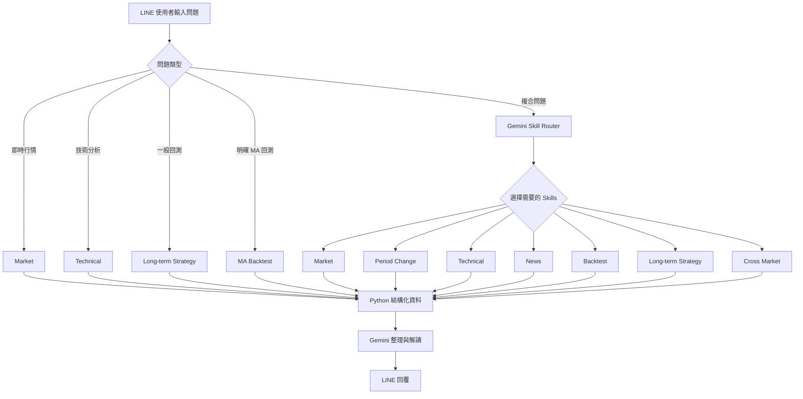
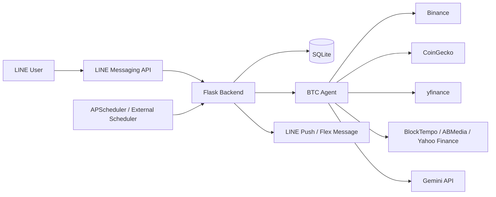
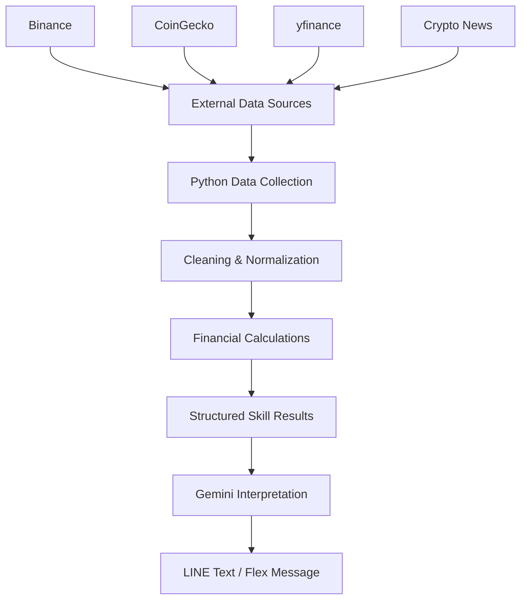

# ₿ BTC AI 智能投資資訊助手

<p align="center">
  <b>Bitcoin AI Investment Information Assistant</b><br>
  LINE Bot × Market Data × Technical Analysis × Backtesting × News AI × Personalized Alerts
</p>

<p align="center">
  
  
  
  
  
</p>

---

## 📖 專案介紹

**BTC AI 智能投資資訊助手**是一套以 LINE Bot 為主要操作介面的 Bitcoin 市場資訊整合系統。

系統整合：

- Bitcoin 即時市場行情
- 技術指標
- 加密貨幣新聞
- 歷史策略回測
- 長期策略比較
- 跨市場分析
- 個人化提醒
- 每日主動推播

並透過 Gemini AI Agent 判斷使用者問題需要哪些分析模組，再將 Python 實際取得與計算的結果整理成適合 LINE 閱讀的內容。

本專案的核心概念是：

> **Python 負責資料取得與數值計算，AI 負責理解問題與統整解讀。**

藉此降低生成式 AI 自行產生金融數字的風險，同時保留自然語言互動的便利性。

---

## 🎯 專案動機

本專案主要從四個使用情境出發：

### 1. 資訊分散在不同平台

即時行情、技術指標、新聞、回測與跨市場資料分散在不同平台，使用者需要反覆切換與自行整理，增加取得完整資訊的時間與理解成本。

### 2. 無法長時間盯盤

Bitcoin 全年無休交易，價格與成交量可能在短時間內快速變化，使用者難以長時間盯盤，也可能錯過重要波動與關鍵時點。

### 3. 提醒與查詢流程分散

使用者往往需要分別設定提醒、查詢行情與解讀市場訊號，缺乏一個能整合「查詢、分析、提醒」的單一入口。

### 4. 分析結果理解門檻較高

RSI、MACD、均線、回測與跨市場相關性需整合後才能形成較完整的判讀；不同長期持有策略的報酬、波動與風險也不容易直接比較。

此外，從長期持有者 BTC 持有量的市場資料可以觀察到，長期持有部位具有累積現象，因此本專案進一步加入長期策略回測，讓系統不只回答「現在市場如何」，也能比較「不同長期持有方式在歷史上的風險與績效」。

---

## 👤 目標使用者與產品定位

### WHO｜目標使用者

- 持有或關注 BTC 的輕量使用者
- 非高頻交易者
- 不希望長時間盯盤
- 不想反覆切換多個平台
- 希望重要狀況發生時即時收到通知
- 有疑問時希望直接追問 AI
- 希望理解長期策略差異，但不具量化回測背景

### NEED｜使用需求

```text
不用一直看盤
   ↓
重要時再提醒我
   ↓
想了解時直接問
   ↓
AI 幫我整合資訊
```

### POSITIONING｜產品定位

Binance、TradingView 等專業平台功能更完整，本專案不以取代它們為目標。

本專案整合的是「使用情境」：

```text
資訊取得
   ↓
AI 解讀
   ↓
個人化提醒
   ↓
後續追問
```

並將流程集中在 LINE。

---

## ✨ 核心功能

### 💰 1. BTC 即時市場行情

透過 Binance 取得 BTC/USDT 市場資訊：

- 即時價格
- 約當新台幣參考價
- 近 1 小時漲跌幅
- 24H 漲跌幅
- 24H 最高價 / 最低價
- BTC 成交量
- USDT 成交額
- 成交筆數

也支援自然語言期間查詢，例如：

```text
BTC 最近 3 小時漲多少？
BTC 最近 7 天表現如何？
BTC 近 3 個月漲跌多少？
BTC 2024/1/1 到 2025/1/1 漲多少？
```

---

### 📊 2. 技術分析

系統使用 Binance 日 K 資料計算：

- MA5
- MA20
- MA60
- RSI14
- MACD
- Signal Line
- MACD Histogram

技術指標由 Python 計算後，再由 AI 根據實際數值關係進行文字整理，而不是由 AI 自行推算指標。

常用判讀規則：

```text
MA20 > MA60 → 趨勢偏多
MA20 < MA60 → 趨勢偏空

RSI >= 70 → 超買區
RSI <= 30 → 超賣區
其餘      → 中性區
```

---

### 📰 3. BTC 新聞分析

新聞來源包含：

- **BlockTempo 動區動趨**
- **ABMedia 鏈新聞**
- **Yahoo Finance**（Daily Brief 使用）

資料處理流程：

```text
取得新聞
   ↓
日期與時間整理
   ↓
移除無效資料
   ↓
URL / 標題去重
   ↓
BTC 相關性篩選
   ↓
Gemini 重要性整理
   ↓
新聞文本情緒分析
   ↓
LINE 顯示
```

AI 會將新聞文本整理為：

```text
正向 / 中性 / 負向
```

此分類描述的是**新聞文本的敘事傾向**，不是未來 BTC 漲跌預測。

---

### 📈 4. 策略回測

系統提供兩種歷史回測方式。

#### A. MA20 / MA60 回測

```text
MA20 > MA60 → 持有 BTC
MA20 <= MA60 → 持有現金
```

比較：

- Buy & Hold
- MA20 / MA60 策略
- 扣除交易成本後策略
- 累積報酬
- 年化波動率
- 最大回撤
- Sharpe Ratio
- 持倉切換訊號

#### B. 長期三策略比較

比較：

```text
Buy & Hold
DCA
MA20 / MA60
```

一般使用者輸入：

```text
回測近 5 年
```

系統會預設顯示三種策略。

若使用者明確指定：

```text
MA20/MA60 回測近 5 年
```

則保留單一 MA 回測模式。

---

### 🌎 5. 跨市場分析

透過 `yfinance` 比較：

| 市場 | Yahoo Finance Symbol |
|---|---|
| Bitcoin | BTC-USD |
| Ethereum | ETH-USD |
| S&P 500 | ^GSPC |
| NASDAQ | ^IXIC |
| Gold | GC=F |

分析內容：

- 近期市場報酬率
- BTC 與其他市場報酬率相關係數
- Rolling Correlation
- 最近共同交易日期
- Gemini 跨市場文字解讀

> 相關係數只表示觀察期間內的統計連動，不代表因果關係。

---

### 🔔 6. 個人化提醒

使用者可以直接從 LINE 設定提醒。

#### 價格提醒

```text
提醒 BTC 價格高於 120000
提醒 BTC 價格低於 90000
```

#### 24H 漲跌幅提醒

```text
提醒 24H 漲幅 5%
提醒 24H 跌幅 5%
```

#### RSI 提醒

```text
提醒 RSI 高於 70
提醒 RSI 低於 30
```

#### 1H 劇烈波動提醒

```text
設定波動提醒 3%
```

代表當 BTC 近 1 小時漲跌幅達：

```text
+3% 或 -3%
```

時主動發送 LINE 提醒。

提醒採用狀態防重複機制：

```text
未達條件
   ↓
第一次跨越門檻
   ↓
發送提醒
   ↓
條件仍成立 → 不重複洗版
   ↓
回到門檻外
   ↓
重新待命
   ↓
下次再次跨越 → 再次提醒
```

---

### 🌞 7. 個人化 Daily Brief

使用者可以自訂每日 BTC 摘要時間：

```text
設定每日提醒 09:30
```

Daily Brief 整合：

- BTC 市場行情
- 技術指標
- 重要新聞
- 新聞文本情緒
- BTC / ETH 跨市場資訊
- Gemini AI 今日解讀

每日摘要以 **LINE Flex Message** 卡片呈現，使用者可再點選：

```text
查看完整分析
```

取得完整內容。

---

## 🧪 長期投資策略研究

### 研究問題

> 在相同初始資金、相同研究期間與相同交易成本假設下，Buy & Hold、DCA 與 MA20/MA60 三種長期 BTC 策略，在歷史風險與績效上有何差異？

### 策略定義

#### Buy & Hold

期初一次投入全部資金，持有至研究期末。

#### DCA

將同一筆期初資金分月投入 BTC。

```text
同一筆初始資金
   ↓
分成 12 份
   ↓
前 12 個月逐月投入
```

尚未投入資金視為現金，現金報酬率設為 0%。

#### MA20 / MA60

```text
MA20 > MA60 → 持有 BTC
MA20 <= MA60 → 持有現金
```

---

## 📊 近 5 年策略回測結果

研究期間：

```text
2021-09-28 ～ 2026-09-28
```

資料來源：

```text
Binance BTC/USDT
```

共同條件：

```text
相同初始資金
相同研究期間
每次 BTC 交易成本 0.10%
期末不強制賣出 BTC
```

### 三策略績效比較

| 指標 | Buy & Hold | DCA | MA20/60 |
|---|---:|---:|---:|
| 累積報酬 | +102.92% | +144.40% | +104.96% |
| CAGR | +15.21% | +19.57% | +15.44% |
| 年化波動率 | 51.51% | 45.14% | 35.26% |
| Sharpe Ratio | 0.53 | 0.62 | 0.58 |
| 最大回撤 | -76.63% | -56.47% | -46.56% |
| 期末資產（初始 = 1） | 2.0292 | 2.4440 | 2.0496 |

### 執行細節

```text
DCA 實際投入月數：12
DCA 有效平均買入成本：34,098.70 USDT
MA 持倉切換訊號：39 次
MA 市場曝險比例：52.3%
```

> `39 次` 指買進或賣出造成的持倉切換訊號，不等於 39 組完整進出場交易。

### 研究觀察

本次指定期間內：

- DCA 的累積報酬與 CAGR 數值高於另外兩種策略。
- DCA 的年化波動率與最大回撤低於 Buy & Hold。
- MA20/60 的累積報酬與 Buy & Hold 接近，但年化波動率與最大回撤較低。
- MA20/60 約 52.3% 的研究期間暴露於 BTC 市場，其餘時間持有現金。
- DCA 與 MA20/60 的 Sharpe Ratio 在本次期間高於 Buy & Hold。

以上僅為歷史資料比較，不代表任何策略在未來會維持相同表現。

---

## 🤖 AI Agent 架構

目前 Agent 可使用的主要 Analysis Skills：

```python
get_btc_market()
get_btc_period_change()
get_btc_technical()
get_btc_news()
get_btc_backtest()
get_btc_long_term_strategy_comparison()
get_cross_market()
```

Gemini 會判斷問題狀態：

```text
OK
CLARIFY
OUT_OF_SCOPE
```

再決定需要哪些 Skills。

### Agent Flow


```mermaid
flowchart TD
    A[LINE 使用者輸入問題] --> B{問題類型}

    B -->|即時行情| C[Market]
    B -->|技術分析| D[Technical]
    B -->|一般回測| E[Long-term Strategy]
    B -->|明確 MA 回測| F[MA Backtest]
    B -->|複合問題| G[Gemini Skill Router]

    G --> H{選擇需要的 Skills}
    H --> I[Market]
    H --> J[Period Change]
    H --> K[Technical]
    H --> L[News]
    H --> M[Backtest]
    H --> N[Long-term Strategy]
    H --> O[Cross Market]

    C --> P[Python 結構化資料]
    D --> P
    E --> P
    F --> P
    I --> P
    J --> P
    K --> P
    L --> P
    M --> P
    N --> P
    O --> P

    P --> Q[Gemini 整理與解讀]
    Q --> R[LINE 回覆]
```

部分常見查詢可直接由 Python 模組處理，不必先等待 Gemini Skill Router。

---

## 🏗️ 系統架構


```mermaid
flowchart LR
    User[LINE User] --> LINE[LINE Messaging API]
    LINE --> Flask[Flask Backend]

    Flask --> DB[(SQLite)]
    Flask --> Agent[BTC Agent]
    Flask --> Push[LINE Push / Flex Message]

    Agent --> Binance[Binance]
    Agent --> CoinGecko[CoinGecko]
    Agent --> YF[yfinance]
    Agent --> News[BlockTempo / ABMedia / Yahoo Finance]
    Agent --> Gemini[Gemini API]

    Scheduler[APScheduler / External Scheduler] --> Flask
```

---

## 🔄 資料 Pipeline


```mermaid
flowchart TD
    A[External Data Sources] --> B[Python Data Collection]
    B --> C[Cleaning & Normalization]
    C --> D[Financial Calculations]
    D --> E[Structured Skill Results]
    E --> F[Gemini Interpretation]
    F --> G[LINE Text / Flex Message]

    A1[Binance] --> A
    A2[CoinGecko] --> A
    A3[yfinance] --> A
    A4[Crypto News] --> A
```

---

## 🗂️ 資料來源

| 資料類型 | 來源 | 主要用途 |
|---|---|---|
| BTC 即時行情 | Binance | 價格、24H 行情、成交量 |
| BTC OHLCV | Binance | MA、RSI、MACD |
| BTC 歷史日資料 | Binance / CoinGecko | 歷史查詢與策略回測 |
| 跨市場資料 | yfinance | BTC、ETH、S&P 500、NASDAQ、Gold |
| 最新加密新聞 | BlockTempo | 最新市場消息 |
| 最新加密新聞 | ABMedia | 最新市場消息 |
| Daily 新聞 | Yahoo Finance | Daily 時間窗新聞 |
| USD/TWD | yfinance | 約當新台幣價格 |
| 長期持有趨勢圖 | CoinGlass | 專題研究動機 |

### 歷史資料來源一致性

若完整區間可由 Binance 涵蓋：

```text
Binance BTC/USDT
```

若查詢起點早於 Binance 可用歷史：

```text
CoinGecko BTC/USD
```

整段使用單一來源，不在同一次回測中混接 Binance 與 CoinGecko。

---

## 🛠️ Tech Stack

### Backend

```text
Python
Flask
APScheduler
SQLite
```

### Data & Analysis

```text
Pandas
Requests
yfinance
BeautifulSoup
Binance API
CoinGecko
```

### AI

```text
Google Gemini API
```

### Interface

```text
LINE Messaging API
LINE Bot SDK v3
LINE Flex Message
```

---

## 📁 專案結構

建議 GitHub Repository 整理成：

```text
btc-ai-line-bot/
│
├── app_project_final.py
├── btc_agent_final.py
├── requirements.txt
├── .gitignore
├── README.md
│
└── btc_ai.db       # 本機資料庫，不建議上傳公開 Repo
```

主程式使用：

```python
import btc_agent_final as btc_agent
```

因此 Agent 檔案名稱必須為：

```text
btc_agent_final.py
```

---

# 🚀 Getting Started

## 1. Clone Repository

```bash
git clone <YOUR_GITHUB_REPOSITORY_URL>
cd btc-ai-line-bot
```

---

## 2. 建立 Python 虛擬環境

### Windows

```bash
python -m venv .venv
.venv\Scripts\activate
```

### macOS / Linux

```bash
python3 -m venv .venv
source .venv/bin/activate
```

---

## 3. 安裝套件

```bash
pip install -r requirements.txt
```

主要套件：

```text
flask
line-bot-sdk
requests
pandas
yfinance
beautifulsoup4
APScheduler
python-dotenv
```

若 BeautifulSoup 使用 `lxml` parser：

```bash
pip install lxml
```

---

## 4. 建立 `.env`

在專案根目錄新增：

```text
.env
```

內容：

```env
LINE_CHANNEL_ACCESS_TOKEN=your_line_channel_access_token
LINE_CHANNEL_SECRET=your_line_channel_secret
GEMINI_API_KEY=your_gemini_api_key
SCHEDULER_SECRET=your_scheduler_secret
```

### Environment Variables

| Variable | 用途 |
|---|---|
| `LINE_CHANNEL_ACCESS_TOKEN` | LINE Messaging API |
| `LINE_CHANNEL_SECRET` | LINE Webhook 驗證 |
| `GEMINI_API_KEY` | Gemini API |
| `SCHEDULER_SECRET` | 保護 `/scheduler-check` Endpoint |

> ⚠️ `.env` 含有私密金鑰，請勿上傳至 GitHub。

---

## 5. 啟動 Flask

```bash
python app_project_final.py
```

預設：

```text
http://127.0.0.1:5000
```

---

# 🌐 Flask Routes

| Route | Method | 功能 |
|---|---|---|
| `/callback` | POST | LINE Webhook |
| `/btc-market` | GET | 取得 BTC 市場行情 |
| `/n8n-test` | GET | n8n 連線測試 |
| `/scheduler-check` | GET | 外部排程觸發提醒檢查 |

---

# ⏰ Scheduler

本機直接執行 Python 主程式時，APScheduler 主要檢查：

| 工作 | 頻率 |
|---|---:|
| 每日摘要時間檢查 | 每 1 分鐘 |
| 價格 / 漲跌 / RSI 提醒 | 每 5 分鐘 |
| 1H 波動提醒 | 每 5 分鐘 |

Timezone：

```text
Asia/Taipei
```

本機版本需要 Python 程式與電腦持續運行，排程才會持續工作。

---

# 💬 LINE 使用範例

## 市場行情

```text
現在 BTC 一顆多少？
BTC 最近 24 小時漲多少？
BTC 2025/1/1 到 2026/1/1 漲多少？
```

## 技術分析

```text
BTC 現在技術面如何？
RSI 現在多少？
MACD 現在怎麼看？
```

## 新聞

```text
最近有什麼 BTC 重要新聞？
最新消息
```

## 三策略回測

```text
回測近 5 年
回測近 3 年
比較近 5 年 Buy & Hold、DCA、MA20/60
```

## MA 回測

```text
MA20/MA60 回測近 5 年
以前照均線操作會怎樣？
```

## 自訂日期回測

```text
比較 2021/1/1 到 2025/12/31 的策略回測
```

## 跨市場

```text
跨市場
最近 BTC 跟 NASDAQ 有一起動嗎？
```

## 個人化提醒

```text
提醒 BTC 價格高於 120000
提醒 BTC 價格低於 90000
提醒 24H 漲幅 5%
提醒 24H 跌幅 5%
提醒 RSI 高於 70
提醒 RSI 低於 30
設定波動提醒 3%
```

## 每日摘要

```text
設定每日提醒 09:30
查看每日提醒
關閉每日提醒
```

## 提醒管理

```text
查看提醒
檢查提醒
刪除提醒 1
個人化設置
```

---

# 🗄️ SQLite

系統使用：

```text
btc_ai.db
```

### `alerts`

儲存：

- LINE User ID
- 提醒類型
- 提醒門檻
- 是否啟用
- 條件狀態
- 最近觸發時間

### `user_settings`

儲存：

- 每日摘要時間
- 是否啟用每日摘要
- 最近推播日期
- 是否啟用 1H 波動提醒
- 波動門檻
- 更新時間

---

# 🔐 Security

`.gitignore` 建議至少包含：

```gitignore
# Private
.env

# Python
__pycache__/
*.pyc

# Virtual environment
.venv/
venv/

# Editor
.vscode/
.ipynb_checkpoints/

# Database
*.db

# System
.DS_Store
Thumbs.db
```

### 上傳 GitHub 前請確認

- [ ] `.env` 沒有被加入 Git
- [ ] API Key 沒有直接寫在 Python
- [ ] `btc_ai.db` 沒有上傳公開 Repository
- [ ] LINE Channel Access Token 沒有曝光
- [ ] LINE Channel Secret 沒有曝光
- [ ] Gemini API Key 沒有曝光
- [ ] Scheduler Secret 沒有曝光

---

# 🧩 系統設計重點

## 1. AI 不直接負責金融計算

市場價格、MA、RSI、MACD、相關係數與回測結果主要由 Python 計算。

Gemini 主要負責：

```text
理解問題
選擇 Skills
新聞重要性整理
文本情緒分析
自然語言解讀
```

---

## 2. 歷史資料來源一致性

單次歷史分析或回測完整區間只使用一個價格來源，避免 Binance 與 CoinGecko 直接混接。

---

## 3. 回測公平比較

三策略比較使用：

```text
相同初始資金
相同研究期間
相同交易成本設定
```

DCA 將同一筆期初資金分月投入，而不是每月額外投入新收入。

---

## 4. 提醒防重複機制

條件提醒只在「從未達條件跨越到達成條件」時推播。

條件恢復到門檻外後重新待命，避免使用者被相同通知洗版。

---

## 5. LINE Flex Message

每日摘要與提醒可透過 LINE Flex Message 呈現：

```text
市場價格
24H 漲跌
RSI14
新聞情緒
今日焦點
```

更適合手機介面閱讀。

---

# 🔮 Future Work

- [ ] AWS / GCP 正式部署
- [ ] Docker 容器化
- [ ] Cloud Database
- [ ] Binance WebSocket 即時行情
- [ ] ETH / SOL 等更多幣種
- [ ] 更多量化交易策略
- [ ] 不同 DCA 月數比較
- [ ] 不同均線參數比較
- [ ] 不同交易成本情境
- [ ] 回測 Equity Curve 圖表
- [ ] Portfolio Analysis
- [ ] 鏈上數據
- [ ] ETF 資金流
- [ ] Fear & Greed Index
- [ ] Web Dashboard
- [ ] 使用者偏好學習
- [ ] n8n 自動化工作流
- [ ] Cloud-native Scheduler

---

# 👥 Team

## 楊才誼

- 串接 Binance、CoinGecko、yfinance 等資料來源
- 建置 MA20 / MA60、RSI、MACD 與量化回測
- 建立 Gemini AI Agent 與金融分析 Skills
- 串接 LINE Bot 自然語言互動式問答
- 建立使用者個人化設定與 SQLite 儲存

## 梁宗祺

- 定時市場資訊推播與自訂價格警報
- 監測短時間與 24H 劇烈波動
- 導入 MA5 / MA20、RSI 與成交量異常監測
- 讀取個人化提醒條件並觸發 LINE 通知
- 製作推播視覺化與自動化排程流程

### 共同負責

- 系統模組整合與測試
- 雲端部署與服務運行測試
- 最終內容製作與確認

---

# ⚠️ Disclaimer

本專案僅供：

- Python 程式設計學習
- API 串接實作
- AI Agent 專題
- 金融資料分析
- Bitcoin 市場研究
- 歷史策略回測

使用。

本系統提供的市場資料、技術分析、新聞整理、AI 解讀與歷史回測結果，**均不構成任何投資建議**。

回測結果只代表指定期間、參數與成本假設下的歷史模擬。不同期間、DCA 月數、均線參數與交易成本都可能改變結果。

**歷史績效不代表未來績效。**

---

# 📜 License

目前專案以學習、作品集與專題展示用途為主。

若未來公開成為開源專案，可加入：

```text
MIT License
```

或其他合適的開源授權。

---

<p align="center">
  Made with Python 🐍 + LINE 💬 + Bitcoin ₿ + Gemini 🤖
</p>
